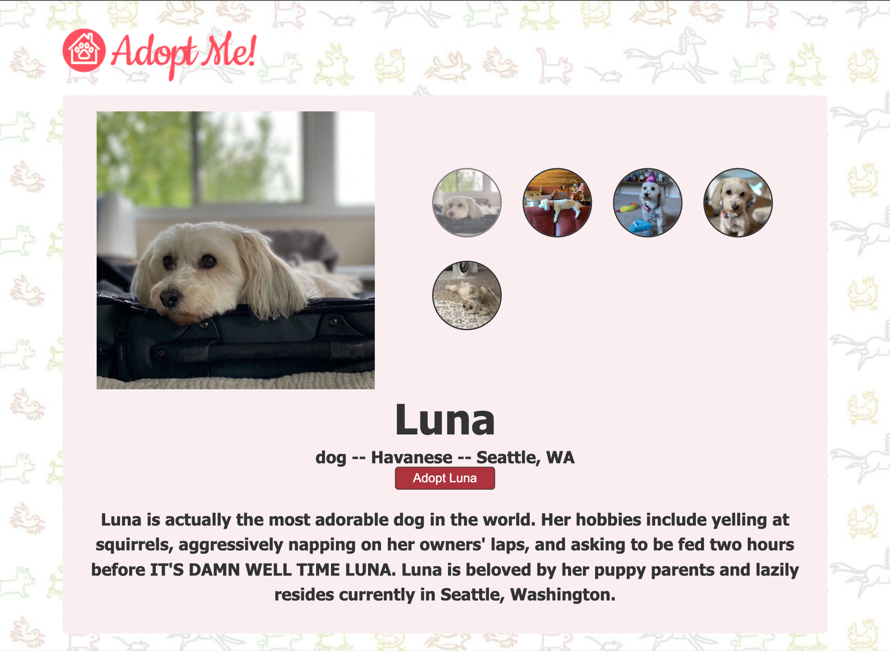
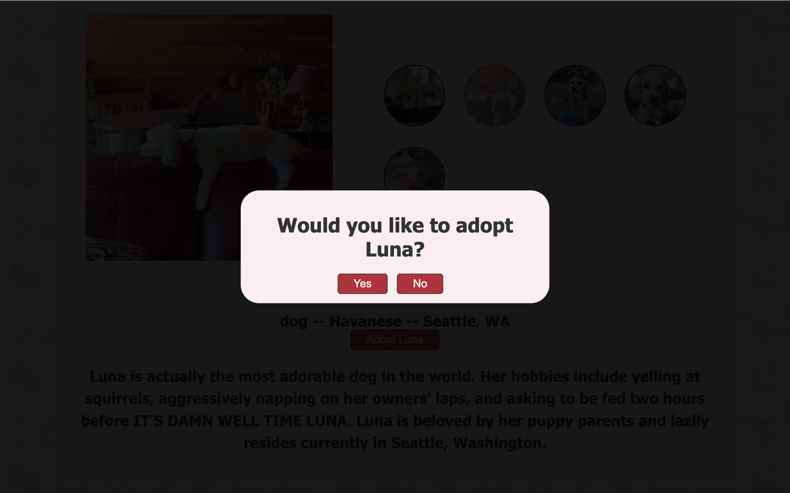
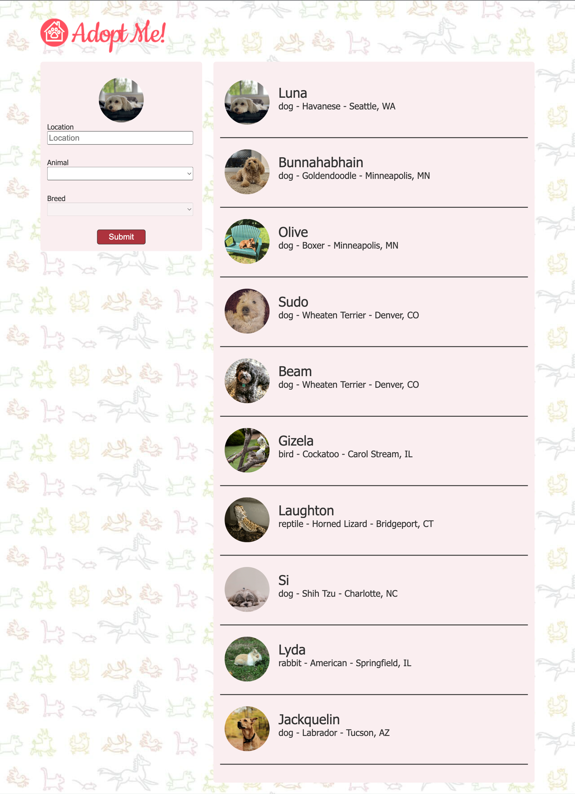

# pet-adoption
Adopt Me!/Adoptables. Reviewing updates to React.js through a pet adoption website. My hope is to attach the pet finder api, so I can specify it for actual pets available for adoption.

## Images of the Website

### Home Page

### Details page for the selected pet

### Modal

### Home Page with selected pet

