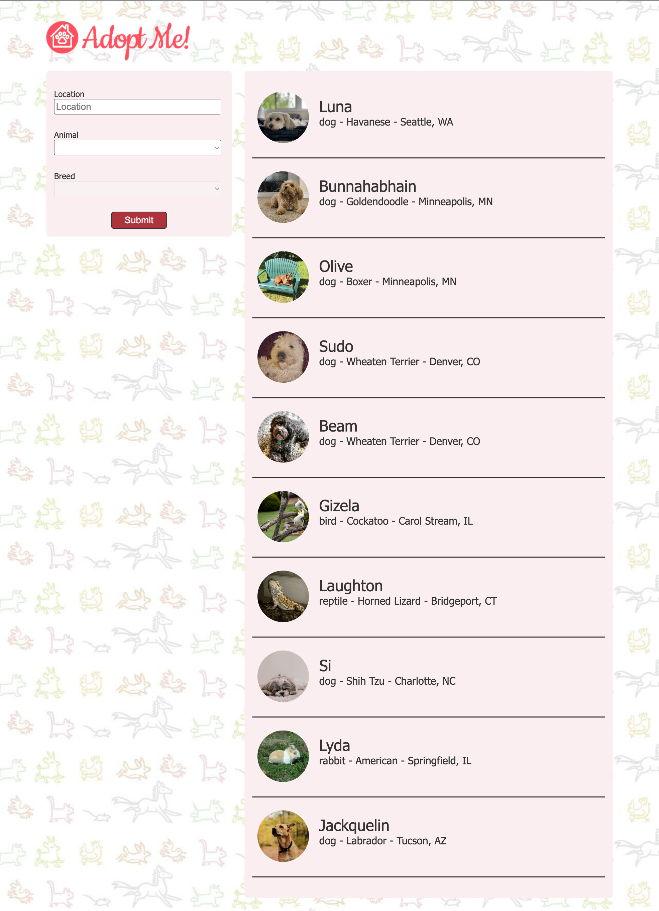
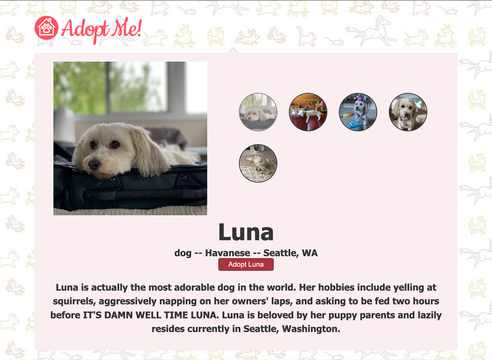
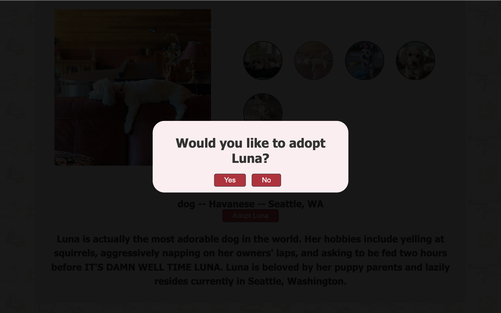
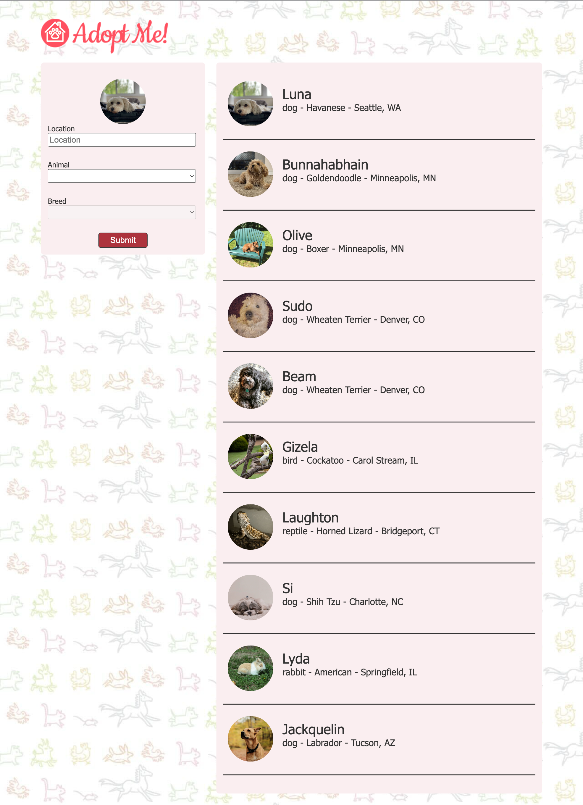

# pet-adoption
Adoptables. Reviewing updates to React.js through a pet adoption website. My hope is to attach the pet finder api, so I can specify it for actual pets available for adoption. For now, I will use mock data through a Frontend Masters API.

## Images of the Website

### Home Page

### Details page for the selected pet

### Modal

### Home Page with selected pet
